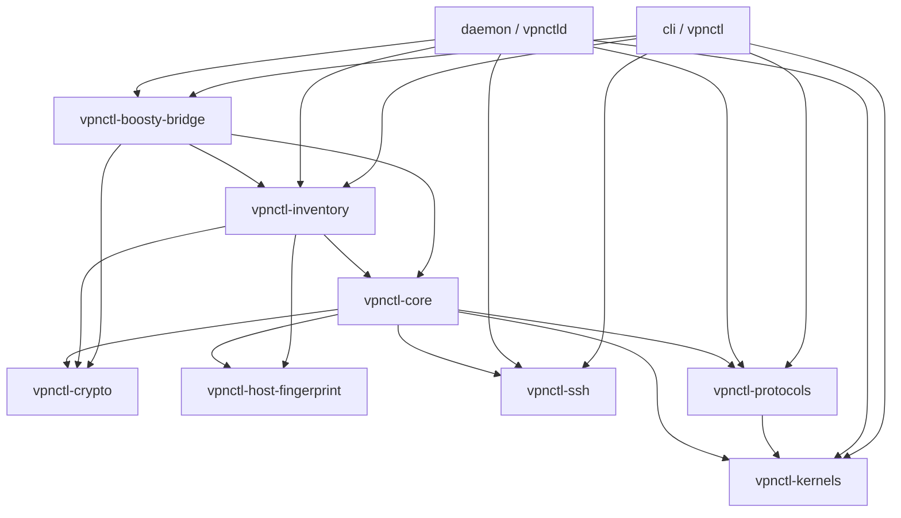

# Агенто-Читаемая Архитектурная Карта Проекта vpnctl (Master Index)

> **Статус проекта:** Версия `0.9.0`, Rust 1.85 (Edition 2024).  
> **Аудит кодовой базы:** 410 файлов Rust, 151 289 строк кода.  
> **Покрытие:** 100% модулей проанализировано построчно.

---

## 1. Навигатор по Детальным Спецификациям Модулей

Карта разделена на детальные спецификации с контрактами данных и сигнатурами:
1. [`docs/agent-map/crates-foundation.md`](crates-foundation.md): Базовый фундамент:
   - `vpnctl-core`: доменная модель (`Server`, `User`, `RenderCtx`), трейты `Kernel`, `Protocol`, `SshTransport`, `Registry`, POSIX-экранирование `shell::single_quote`, RFC 3986 `url_host::host_for_url`.
   - `vpnctl-crypto`: генераторы Curve25519 (X25519, WireGuard), UUID v4, 32-hex device_id, AmneziaWG обфускация (`gen_amnezia_obfs`), валидатор пар ключей `wireguard_keypair_matches`.
   - `vpnctl-host-fingerprint`: сканирование и каноникализация SSH отпечатков (`SHA256:...`), защита от getopt flag-injection (`--`).
   - `vpnctl-ssh`: асинхронный native SSH транспорт `RusshTransport` + `SubprocessSshTransport` для бастионов (ProxyJump).
   - `vpnctl-boosty-bridge`: биллинг-мост Boosty, стейт-машина подписок (`reconcile`), защита от массового отключения.
2. [`docs/agent-map/crates-protocols-kernels.md`](crates-protocols-kernels.md): Ядра и Протоколы:
   - 11 протоколов: VLESS REALITY, VLESS-WS, VLESS-xHTTP, TUIC v5, Hysteria 2, Shadowsocks 2022, Naive, AnyTLS, Trojan, WireGuard, AmneziaWG (v2/v3).
   - 4 системных ядра: `SingBox`, `AmneziaWg`, `Caddy` (+ forwardproxy), `Xray`.
   - Детерминированное распределение IP WireGuard (`10.66.0.0/24`, лимит 253 пира).
3. [`docs/agent-map/crates-inventory.md`](crates-inventory.md): Слой Персистентности (SQLite):
   - 58 миграций схемы, WAL-режим, foreign keys, транзакционный аудит `audit_log`.
   - Таблицы: `servers`, `server_secrets`, `users`, `grants`, `node_health`, `server_quality_samples`, `server_billing`, `boosty_settings`.
   - Подсистемы горячего бэкапа (`sqlite3_backup`), аналитики совместного использования подписок и обнаружения дрифта.
4. [`docs/agent-map/daemon-vpnctld.md`](daemon-vpnctld.md): Сервис `vpnctld` (Control Plane):
   - Сетевой стек Axum: публичные эндпоинты `/sub/{token}` и `/api/v1/app/config/{device_id}`.
   - Административный интерфейс `/admin/` (Maud, HTMX, CSRF, operator-action policy).
   - Wizard автоматического развертывания нод в один клик (SSE стрим, генерация deploy-ключа, харденинг, установка ПО, фаервол).
   - 10 фоновых поллеров (метрики нод, GeoIP, замеры задержки, статистика сессий).
5. [`docs/agent-map/cli-vpnctl.md`](cli-vpnctl.md): Консольная утилита автоматизации:
   - Команды управления серверами, пользователями, грантами, ключами, деплоем и резервными копиями.

---

## 2. Матрица Строгих Архитектурных Инвариантов

Любой агент или разработчик, вносящий изменения в проект, **ОБЯЗАН** соблюдать следующие инварианты:

| Инвариант | Область действия | Техническое правило | Механизм проверки |
|---|---|---|---|
| **Ортогональность Ядер и Протоколов** | `crates/core`, `crates/kernels`, `crates/protocols` | Добавление ядра или протокола требует создания одного файла и одной строки в `cli/src/registry.rs`. Слои core/inventory/daemon не должны меняться. | Компиляция, review-agent gate |
| **Stateless Протоколы** | `crates/protocols` | Реализации `Protocol` не содержат изменяемого состояния и секретов. Секреты ноды передаются строго через `RenderCtx::secrets`. | Архитектурный контракт трейта |
| **Защита от утечки секретов** | `crates/core/src/models.rs` | Поля `tuic_password`, `wireguard_private`, `sub_token`, `vpn_router_device_id` помечены `#[serde(skip_serializing)]` и маскируются в `Debug`. | Тесты `user_secret_redaction` |
| **Запрет `unwrap` и `panic`** | Весь workspace (`Cargo.toml`) | Запрещены любые вызовы `unwrap()`, `expect()`, `panic!()` в production-коде (допустимо только в тестах). | Clippy lints `unwrap_used = "deny"`, `panic = "deny"` |
| **Запрет `unsafe` и OpenSSL** | Весь workspace (`Cargo.toml`) | Запрещен `unsafe` (`unsafe_code = "forbid"`). Запрещены C-зависимости `openssl-sys` / `native-tls` (используется чистый Rust crypto). | `cargo deny check`, Clippy |
| **Обратная совместимость ссылок** | `crates/protocols`, `daemon` | Формат выдачи `/sub/`, `/api/v1/app/config/` и share-link должен сохраняться байт-в-байт. | `spec_share_link_byte_equality.rs` |
| **Неизменяемый аудит-лог** | `crates/inventory` | Любая мутация данных в БД обязана генерировать запись в `audit_log`. При отсутствии изменений аудит не спамит. | Транзакции SQLite в `sqlite/` |
| **Operator-Action Policy** | `daemon`, Web UI | Никакое предупреждение или ошибка в веб-интерфейсе не должны отправлять оператора в SSH-терминал. Демон выполняет действие сам или показывает кнопку. | `AGENTS.md`, admin templates |
| **Deploy-Key Invariant** | `daemon/src/wizard_bootstrap` | Ни один сервер не переводится в активный статус без верификации наличия deploy-ключа в `authorized_keys`. | Проверка SSH reachability |

---

## 3. Граф Зависимостей Крейтов



---

## 4. Инструкция для ИИ-Агентов по Модификации Кода

При решении задач в репозитории `vpnctl`:
1. **Создание новой ветки и worktree**: всегда работать в отдельном git worktree, не трогать ветку `main`.
2. **Локальный гейт проверок перед коммитом**:
   ```bash
   cargo fmt --all -- --check
   cargo clippy --workspace --all-targets -- -D warnings
   cargo test --workspace --all-targets
   cargo deny check
   ```
3. **Обновление персистентного трекера**: при структурных изменениях в кодовой базе обновлять спецификации в каталоге `docs/agent-map/` и валидировать состояние через `./docs/agent-map/supervisor.sh`.
